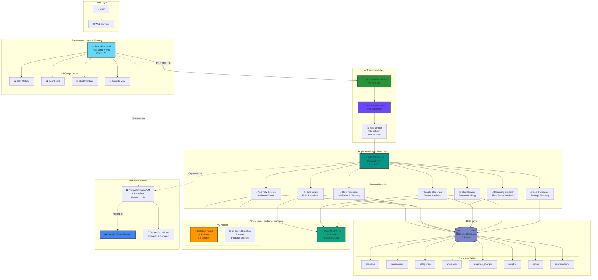

# 💰 Dinera Financial Coach

> **AI-powered personal financial analysis platform with intelligent spending insights, ML anomaly detection, and conversational coaching**

[](https://fastapi.tiangolo.com)
[](https://react.dev)
[](https://www.typescriptlang.org)
[](https://www.python.org)
[](https://openai.com)
[](LICENSE)

---

## 📋 Table of Contents

- [Overview](#overview)
- [Features](#features)
- [Architecture](#architecture)
- [Technology Stack](#technology-stack)
- [Quick Start](#quick-start)
- [Installation](#installation)
- [Usage](#usage)
- [API Documentation](#api-documentation)
- [Deployment](#deployment)
- [Contributing](#contributing)
- [License](#license)

---

## 🎯 Overview

**Dinera Financial Coach** is an intelligent financial analysis platform that combines machine learning, natural language processing, and conversational AI to help users:

- 📊 **Automatically categorize** financial transactions using hybrid AI + rule-based systems
- 🚨 **Detect unusual spending** with Isolation Forest machine learning algorithm
- 💳 **Identify subscriptions** and forgotten recurring charges (gray charges)
- 💬 **Chat with an AI coach** that has real-time access to your financial data
- 💡 **Receive personalized insights** and actionable savings recommendations
- 🎯 **Set and achieve** savings goals with AI-powered forecasting

### Why Dinera?

Traditional budgeting apps lack intelligence and personalization. Dinera goes beyond simple expense tracking by:

✅ Training ML models **on your individual data** for personalized anomaly detection  
✅ Using **GPT-4o with function calling** for natural language financial queries  
✅ Providing **explainable AI** - every insight includes reasoning and confidence scores  
✅ Offering **hybrid categorization** - 70% rule-based speed + 30% AI accuracy  
✅ Detecting **gray charges** - small forgotten subscriptions costing $100s annually  

---

## ✨ Features

### 🏷️ Smart Categorization
- **Hybrid Approach**: Rule-based patterns (~70% coverage) + GPT-4o for complex transactions
- **12 Default Categories**: Housing, Groceries, Dining, Transportation, Healthcare, Shopping, Entertainment, Subscriptions, Utilities, Travel, Income, Other
- **Confidence Scores**: See how confident the AI is about each categorization (0.0-1.0)
- **Source Tracking**: Know if categorization came from rules, AI, or user input

### 🚨 Anomaly Detection
- **ML-Powered**: Isolation Forest algorithm trained on YOUR data (personalized)
- **8-Dimensional Features**: Amount, rarity, temporal patterns
- **Severity Levels**: High, Medium, Low based on deviation from typical spending
- **Explainable Results**: Understand WHY each transaction was flagged
- **Smart Fallback**: Uses statistical z-score for datasets <50 transactions

### 🔄 Recurring Charge Detection
- **Subscription Tracking**: Automatically identifies monthly and weekly patterns
- **Gray Charge Alerts**: Flags small, unknown recurring charges you might have forgotten
- **Frequency Analysis**: Shows how often each charge occurs
- **Cost Projection**: Annual cost calculations for all subscriptions

### 💡 AI-Powered Insights
- **Personalized Advice**: GPT-4o generates actionable recommendations
- **Pattern Recognition**: Detects merchant habits, weekend splurges, payday impulse spending
- **Savings Opportunities**: Calculates potential yearly savings for each insight
- **Priority Ordering**: Most impactful insights shown first
- **Explainable AI**: Every insight includes reasoning and confidence score

### 💬 Conversational AI Coach
- **Natural Language Queries**: Ask questions like "What are my biggest expenses?"
- **Function Calling**: 7 tools for real-time data access (spending summary, anomalies, recurring charges, insights, category details, transaction search, month comparison)
- **Streaming Responses**: Real-time token-by-token generation
- **Conversation Memory**: Maintains context across multiple turns (last 10 messages)
- **Intent Enforcement**: Rejects off-topic queries, stays focused on financial coaching

### 🎯 Goal Forecasting
- **Savings Targets**: Set a monthly savings goal
- **Smart Suggestions**: AI recommends specific category cuts
- **Achievability Check**: Honest assessment of goal feasibility
- **Actionable Plans**: Step-by-step recommendations with difficulty ratings

---

## 🏗️ Architecture

Dinera uses a **microservice architecture** with distinct layers for frontend, API gateway, application logic, data storage, and AI/ML services.



### Architecture Layers Explained

#### 1. **Client Layer**
- Users access via modern web browsers (Chrome, Firefox, Safari)
- Responsive design works on desktop, tablet, mobile

#### 2. **Presentation Layer (React Frontend)**
- **Technology**: React 18.2 + TypeScript 5.3 + Tailwind CSS + Vite
- **Components**: Upload, Dashboard, Chat, Insights, Anomalies, Recurring Charges, Goals
- **State Management**: React hooks (useState, useEffect)
- **Styling**: Utility-first Tailwind CSS with warm neutral palette

#### 3. **API Gateway Layer**
- **Nginx**: Reverse proxy for frontend serving and API routing
- **Clerk Auth**: JWT token validation on protected routes
- **Rate Limiter**: Sliding window algorithm (30 chat/min, 100 API/min)

#### 4. **Application Layer (FastAPI Backend)**
- **FastAPI**: High-performance async Python API framework
- **7 Service Modules**: Modular, reusable components for each feature
- **15+ API Endpoints**: RESTful design with automatic OpenAPI docs

#### 5. **Data Layer (SQLite)**
- **8 Tables**: Sessions, Transactions, Categories, Anomalies, Recurring Charges, Insights, Deltas, Conversations
- **SQLAlchemy ORM**: Type-safe database operations
- **Foreign Keys**: Maintains referential integrity

#### 6. **AI/ML Layer**
- **OpenAI GPT-4o**: Transaction categorization, insight generation, chat
- **Isolation Forest**: ML anomaly detection (≥50 transactions)
- **Statistical Analysis**: Z-score fallback (<50 transactions)

#### 7. **Cloud Infrastructure**
- **GCP Compute Engine**: e2-medium VM (2 vCPU, 4GB RAM)
- **Ubuntu 22.04 LTS**: Stable Linux distribution
- **Docker**: Containerized deployment

---

## 🛠️ Technology Stack

### Backend
| Technology | Version | Purpose |
|------------|---------|---------|
| Python | 3.10+ | Core language |
| FastAPI | 0.109 | REST API framework |
| SQLAlchemy | 2.0 | Database ORM |
| Pydantic | 2.5 | Data validation |
| Pandas | 2.2 | CSV processing |
| scikit-learn | 1.4+ | ML (Isolation Forest) |
| OpenAI | 1.12+ | GPT-4o integration |
| Uvicorn | 0.27 | ASGI server |

### Frontend
| Technology | Version | Purpose |
|------------|---------|---------|
| React | 18.2 | UI framework |
| TypeScript | 5.3 | Type safety |
| Vite | 5.0 | Build tool |
| Tailwind CSS | 3.4 | Styling |
| Recharts | 2.12 | Charts/visualizations |

### Infrastructure
| Technology | Version | Purpose |
|------------|---------|---------|
| Docker | Latest | Containerization |
| Docker Compose | Latest | Service orchestration |
| Nginx | 1.18+ | Reverse proxy |
| SQLite | 3 | Database |
| GCP Compute Engine | - | Cloud hosting |

### Authentication & Security
| Technology | Version | Purpose |
|------------|---------|---------|
| Clerk | Latest | User authentication |
| PyJWT | 2.8+ | JWT token handling |
| python-dotenv | 1.0 | Environment variables |

---

## 🚀 Quick Start

### Prerequisites

- **Python**: 3.10 or higher
- **Node.js**: 18 or higher
- **npm**: 9 or higher
- **OpenAI API Key**: Get one at [platform.openai.com](https://platform.openai.com)
- **Clerk Account**: Sign up at [clerk.com](https://clerk.com)

### 1. Clone Repository

```bash
git clone https://github.com/your-username/dinera-financial.git
cd dinera-financial
```

### 2. Backend Setup

```bash
# Navigate to backend
cd backend

# Create virtual environment
python3 -m venv venv

# Activate virtual environment
source venv/bin/activate  # On Windows: venv\Scripts\activate

# Install dependencies
pip install -r requirements.txt
```

### 3. Frontend Setup

```bash
# Navigate to frontend
cd ../frontend

# Install dependencies
npm install
```

### 4. Environment Configuration

Create `.env` file in project root:

```bash
# OpenAI Configuration
OPENAI_API_KEY=sk-your-api-key-here
OPENAI_MODEL=gpt-4o

# Database
DATABASE_URL=sqlite:///./financial_coach.db

# API Configuration
API_HOST=0.0.0.0
API_PORT=8000
DEBUG=true

# CORS
CORS_ORIGINS=http://localhost:5173,http://localhost:3000

# Clerk Authentication
VITE_CLERK_PUBLISHABLE_KEY=pk_test_your-clerk-key
```

### 5. Run the Application

**Terminal 1 - Backend:**
```bash
cd backend
source venv/bin/activate
python main.py
# Or: uvicorn main:app --reload --host 0.0.0.0 --port 8000
```

**Terminal 2 - Frontend:**
```bash
cd frontend
npm run dev
```

### 6. Access the Application

- **Frontend**: http://localhost:5173
- **Backend API Docs**: http://localhost:8000/docs
- **Health Check**: http://localhost:8000/health

---

## 📦 Installation

### Development Installation

```bash
# Clone repository
git clone https://github.com/your-username/dinera-financial.git
cd dinera-financial

# Setup backend
cd backend
python3 -m venv venv
source venv/bin/activate
pip install -r requirements.txt

# Setup frontend
cd ../frontend
npm install

# Configure environment
cp .env.example .env
# Edit .env with your API keys

# Run development servers
# Terminal 1:
cd backend && python main.py
# Terminal 2:
cd frontend && npm run dev
```

### Production Installation (Docker)

```bash
# Build containers
docker-compose build

# Start services
docker-compose up -d

# Check status
docker-compose ps

# View logs
docker-compose logs -f

# Stop services
docker-compose down
```

---

## 💻 Usage

### 1. Upload CSV

Upload a CSV file with your financial transactions:

**CSV Format:**
```csv
date,description,amount
2024-01-15,STARBUCKS COFFEE,-5.75
2024-01-15,PAYCHECK DIRECT DEPOSIT,3200.00
2024-01-16,NETFLIX SUBSCRIPTION,-15.99
2024-01-17,WHOLE FOODS MARKET,-82.34
```

**Requirements:**
- Columns: `date`, `description`, `amount`
- Date formats: YYYY-MM-DD, MM/DD/YYYY, DD/MM/YYYY, MM-DD-YYYY, YYYY/MM/DD
- Amount: Positive for income, negative for expenses
- Max rows: 10,000

### 2. Run Analysis

Click **"Analyze"** to process transactions:

- **Categorization** (~5-10 seconds): 70% rule-based + 30% AI
- **Anomaly Detection** (~1-5 seconds): ML training + prediction
- **Recurring Detection** (~2-3 seconds): Time-series grouping
- **Insight Generation** (~3-5 seconds): AI recommendations

### 3. View Dashboard

Explore your financial data:

- **Spending Summary**: Total income, spending, net balance
- **Category Breakdown**: Interactive pie chart
- **Top Categories**: Bar chart with percentages
- **Recent Transactions**: Sortable table

### 4. Review Insights

See AI-generated recommendations:

- **High Priority**: Critical issues (e.g., spending 60% above average)
- **Medium Priority**: Optimization opportunities (e.g., subscription review)
- **Positive**: Achievements (e.g., reduced spending)

### 5. Chat with AI Coach

Ask questions in natural language:

**Example Queries:**
```
"What are my biggest expenses?"
"Show me unusual transactions"
"How much did I spend on dining?"
"Find all Starbucks purchases"
"Can I save $500 a month?"
"Compare this month to last month"
```

### 6. Set Savings Goals

Enter a target amount and get AI recommendations:

- Achievability assessment
- Specific category cuts
- Difficulty ratings (Easy/Moderate/Hard)
- Step-by-step action plan

---

## 📚 API Documentation

### Core Endpoints

#### Upload CSV
```http
POST /upload
Content-Type: multipart/form-data

file: transactions.csv
```

#### Run Analysis
```http
POST /analyze/{session_id}
```

#### Get Dashboard
```http
GET /dashboard/{session_id}
```

#### Chat (Streaming)
```http
POST /chat/{session_id}
Content-Type: application/json

{
  "message": "What are my biggest expenses?",
  "conversation_id": "optional-uuid"
}
```

#### Get Insights
```http
GET /insights/{session_id}
```

### Interactive API Documentation

Visit **http://localhost:8000/docs** for:
- Full API reference
- Try-it-out functionality
- Request/response schemas
- Authentication details

---

## 🌐 Deployment

### Deploy to Google Cloud Platform

#### 1. Create VM Instance

```bash
gcloud compute instances create dinera-financial \
  --zone=us-central1-a \
  --machine-type=e2-medium \
  --image-family=ubuntu-2204-lts \
  --image-project=ubuntu-os-cloud \
  --boot-disk-size=30GB \
  --tags=http-server,https-server
```

#### 2. SSH into VM

```bash
gcloud compute ssh dinera-financial --zone=us-central1-a
```

#### 3. Install Dependencies

```bash
# Update system
sudo apt update && sudo apt upgrade -y

# Install Python
sudo apt install -y python3.10 python3.10-venv python3-pip

# Install Node.js
curl -fsSL https://deb.nodesource.com/setup_18.x | sudo -E bash -
sudo apt install -y nodejs

# Install Nginx
sudo apt install -y nginx
```

#### 4. Deploy Application

```bash
# Clone repository
cd /var/www
sudo mkdir -p dinera-financial
sudo chown $USER:$USER dinera-financial
git clone https://github.com/your-username/dinera-financial.git dinera-financial
cd dinera-financial

# Setup backend
cd backend
python3 -m venv venv
source venv/bin/activate
pip install -r requirements.txt

# Setup frontend
cd ../frontend
npm install
npm run build

# Configure .env
cd ..
cp .env.example .env
nano .env  # Add your API keys
```

#### 5. Configure systemd Service

Create `/etc/systemd/system/dinera-backend.service`:

```ini
[Unit]
Description=Dinera Financial Backend
After=network.target

[Service]
Type=simple
User=your-username
WorkingDirectory=/var/www/dinera-financial/backend
Environment="PATH=/var/www/dinera-financial/venv/bin"
ExecStart=/var/www/dinera-financial/venv/bin/uvicorn main:app --host 0.0.0.0 --port 8000
Restart=always

[Install]
WantedBy=multi-user.target
```

```bash
sudo systemctl daemon-reload
sudo systemctl enable dinera-backend
sudo systemctl start dinera-backend
```

#### 6. Configure Nginx

Create `/etc/nginx/sites-available/dinera-financial`:

```nginx
server {
    listen 80;
    server_name your-domain.com;

    location / {
        root /var/www/dinera-financial/frontend/dist;
        try_files $uri $uri/ /index.html;
    }

    location /api/ {
        proxy_pass http://localhost:8000/;
        proxy_set_header Host $host;
        proxy_set_header X-Real-IP $remote_addr;
    }
}
```

```bash
sudo ln -s /etc/nginx/sites-available/dinera-financial /etc/nginx/sites-enabled/
sudo nginx -t
sudo systemctl restart nginx
```

#### 7. Configure Firewall

```bash
gcloud compute firewall-rules create allow-http --allow tcp:80
gcloud compute firewall-rules create allow-https --allow tcp:443
gcloud compute firewall-rules create allow-backend --allow tcp:8000
```

#### 8. Test Deployment

```bash
curl http://YOUR_VM_IP:8000/health
```

---

## 🤝 Contributing

We welcome contributions! Please follow these guidelines:

### Development Workflow

1. **Fork** the repository
2. **Create** a feature branch (`git checkout -b feature/amazing-feature`)
3. **Commit** your changes (`git commit -m 'Add amazing feature'`)
4. **Push** to the branch (`git push origin feature/amazing-feature`)
5. **Open** a Pull Request

### Code Style

**Python:**
- Follow PEP 8 guidelines
- Use type hints
- Document functions with docstrings
- Run `black` formatter: `black backend/`

**TypeScript/React:**
- Follow ESLint rules
- Use functional components with hooks
- Add JSDoc comments for complex functions
- Run linter: `npm run lint`

### Testing

```bash
# Backend tests
cd backend
pytest tests/ -v

# Frontend tests
cd frontend
npm test
```

---

## 📄 License

This project is licensed under the MIT License - see the [LICENSE](LICENSE) file for details.

---

## 🙏 Acknowledgments

- **OpenAI** for GPT-4o powering AI features
- **FastAPI** for the high-performance backend framework
- **React Team** for the excellent frontend library
- **scikit-learn** for machine learning algorithms
- **Clerk** for authentication infrastructure

---

## 📧 Contact

**Shiva Bhargav Bhuvanam**  
Email: your-email@example.com  
GitHub: [@your-username](https://github.com/your-username)  
LinkedIn: [your-profile](https://linkedin.com/in/your-profile)

---

## 🌟 Star History

If you find this project useful, please consider giving it a ⭐ on GitHub!

---

**Built with ❤️ for better financial health**

*"This should feel like a quiet, intelligent assistant — not a loud app asking for attention."*
